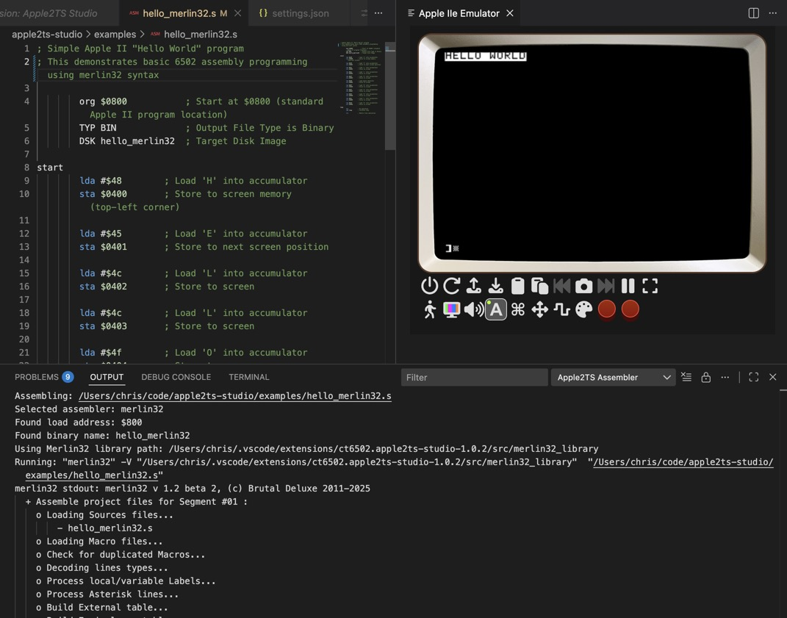

# Apple2TS Studio

A Visual Studio Code extension for 6502 assembly programming with an integrated Apple IIe emulator.



## Features

- **6502/65c02 Assembly Language Support**
  - Syntax highlighting for 6502/65c02 assembly
  - IntelliSense with instruction completion
  - Hover documentation for instructions
  - Apple II specific memory address completion

- **Integrated Apple IIe Emulator**
  - Built-in Apple IIe emulator via [Apple2TS](https://github.com/ct6502/apple2ts)
  - Load and run assembled programs directly
  - Visual debugging capabilities
  - Apple II specific features and memory mapping

- **Build System**
  - Support for 64tass, cl65, and Merlin32 assemblers
  - F5 to build and run in emulator
  - Assembly output and error reporting

## Installation

### From Source

1. Clone this repository
2. Open in VS Code
3. Install dependencies: `npm install`
4. Press F5 to run the extension in a new Extension Development Host window

### Prerequisites

For advanced assembly features, install a macro assembler such as [64tass](https://tass64.sourceforge.net/), [cl65](https://cc65.github.io/doc/cl65.html), or [Merlin32](https://brutaldeluxe.fr/products/crossdevtools/merlin/).

For example, to install the 64tass assembler:

```bash
# macOS with MacPorts
sudo port install 64tass

# macOS with Homebrew
brew install 64tass

# Ubuntu/Debian  
sudo apt-get install 64tass

# Windows
# Download from https://sourceforge.net/projects/tass64/
```

## Usage

### Creating a 6502 Assembly File

1. Create a new file with extension `.s`, `.asm`, or `.a65`
2. Start typing 6502 assembly instructions
3. Use IntelliSense (Ctrl+Space) for instruction completion

### Example Program

```assembly
; Simple Hello World for Apple II using 64tass syntax
        * = $0800

start:
        lda #$48        ; Load 'H'
        sta $0400       ; Store to screen
        lda #$45        ; Load 'E'  
        sta $0401       ; Store to screen
        ; ... more instructions
        rts
```

### Building and Running

1. Open a 6502 assembly file
2. Press F5 or use Command Palette: "Apple2TS: Build & Run in Emulator"
3. The emulator window will open and your program will be loaded

### Commands

- **Apple2TS: Launch Apple IIe Emulator** - Opens the emulator panel
- **Apple2TS: Build & Run in Emulator** - Assembles current file and runs in emulator
- **Apple2TS: Assemble Current File** - Assembles without running

## 6502 Instruction Set

The extension provides complete support for the 65c02 instruction set with:

- All official opcodes (ADC, AND, ASL, BCC, etc.)
- Multiple addressing modes
- Cycle count information
- Detailed instruction documentation

## Apple II Features

- Memory-mapped I/O locations ($C000-$CFFF)
- Screen memory ($0400-$07FF for text mode)
- Common system addresses and vectors
- Apple II specific assembler directives

## Configuration

Configure the extension in VS Code settings.

## Development

### Project Structure

```
apple2ts-studio/
├── src/
│   ├── assembler.ts          # Assembly toolchain integration
│   ├── emulatorPanel.ts      # Webview-based emulator
│   ├── extension.ts          # Main extension file
│   └── languageFeatures.ts  # Language server features
├── syntaxes/
│   └── asm6502.tmGrammar.json # Syntax highlighting
└── examples/
    └── hello_*.s             # Sample assembly programs
    └── graphics.s            # Sample assembly program
    └── 65c02_complete_demo.s # All 65c02 instructions and address modes
```

### Building

```bash
npm install
npm run compile
```

### Packaging

```bash
npm run package
```

### Installing and Reload

```bash
code --install-extension *.vsix --force
```

Then do `Ctrl/Cmd+Shift+P -> Developer:Reload Window` to reload VS Code.

## Update CHANGELOG

See the "Update CHANGELOG" section in the [apple2ts README](https://github.com/ct6502/apple2ts?tab=readme-ov-file#update-changelog).

## Contributing

1. Fork the repository
2. Create a feature branch
3. Make your changes
4. Add tests if applicable
5. Submit a pull request

## License

This project is licensed under the Creative Commons Attribution-ShareAlike 4.0 International
license - see the LICENSE file for details.

## References

- Based on the [Apple2TS](https://github.com/ct6502/apple2ts) TypeScript Apple IIe emulator
- [Assembly Lines: The Complete Book](https://ct6502.org/shop/) by Roger Wagner
- [64tass](https://tass64.sourceforge.net/)
- [cl65](https://cc65.github.io/doc/cl65.html) and [ca65](https://cc65.github.io/doc/ca65.html)
- [Merlin32](https://brutaldeluxe.fr/products/crossdevtools/merlin/)
- [VS Code Language Extension](https://code.visualstudio.com/api/language-extensions/overview)
- [VS Code Extension Publishing](https://code.visualstudio.com/api/working-with-extensions/publishing-extension)